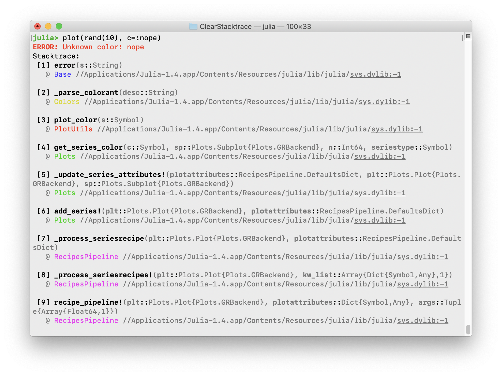
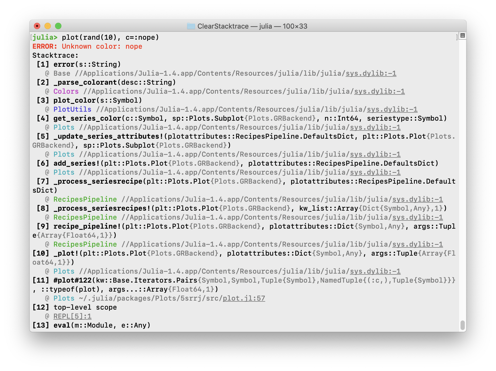
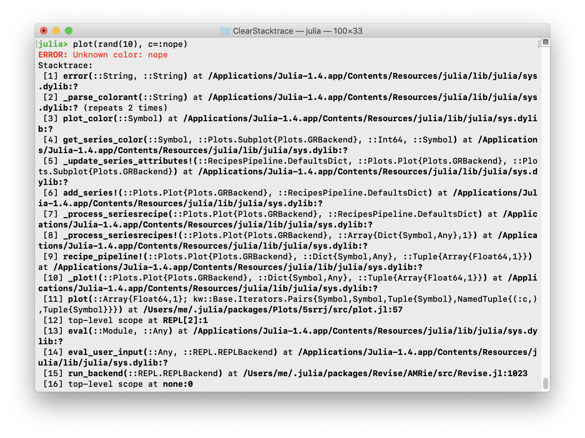

# ClearStacktrace

[](https://travis-ci.com/jkrumbiegel/ClearStacktrace.jl)
[](https://codecov.io/gh/jkrumbiegel/ClearStacktrace.jl)

An experimental package that hooks into `Base.show_backtrace` and replaces normal StackTrace printing behavior with a clearer version that uses alignment and colors to reduce visual clutter and indicate module boundaries, and expands base paths so they are clickable.

All you have to do is install the package via

```julia
] add ClearStacktrace
```

and then execute:
```julia
using ClearStacktrace
```

Tagged version 0.2 produces this:



This fork changes it to:

* Use less bold colours for modules, and none for Base etc. They are in rainbow order.
* Separate the top-level types from their paramters (and thus make these lines darker than paths.)
* Not skip a line. The space is pretty, but small errors filling your screen gets annoying, and IMO it's still easy to scan this.



(Is it a bug that many functions not in Base seem to have Base paths? Would be nice if they were shorter.)

Compare Base:


